# 📘 String Calculator Kata (TDD Driven)

This project is a Ruby implementation of the classic [String Calculator Kata](https://osherove.com/tdd-kata-1) built using **Test-Driven Development (TDD)**.  
Each test case is added incrementally with corresponding feature implementation, showcasing clean commit history and evolution of the solution.

---

## 🧪 What This Is

- 📚 Based on the **TDD principles**: Red → Green → Refactor  
- ✅ Committed after every test and implementation step  
- 📂 Includes full spec coverage  
- 🛠 Built using **RSpec** for testing  

---

## 📦 Setup Instructions

```bash
git clone git@github.com:rinkudas/string-calculator-kata.git
cd string_calculator_kata
bundle install
rspec
```

---

## ✅ Features Covered

Each of these was implemented incrementally:

1. ✅ Returns 0 for an empty string  
2. ✅ Returns the number itself for a single value  
3. ✅ Adds two comma-separated numbers  
4. ✅ Adds multiple comma-separated numbers  
5. ✅ Supports newline (`\n`) as delimiter  
6. ✅ Supports custom single-character delimiters  
7. ✅ Throws error on single negative number  
8. ✅ Throws error on multiple negative numbers  
9. ✅ Tracks how many times `.add` was called  
10. ✅ Ignores numbers > 1000  
11. ✅ Supports custom delimiters of any length  
12. ✅ Supports multiple single-character delimiters  
13. ✅ Supports multiple multi-character delimiters  
14. ✅ Handles edge cases: mixed delimiters and large number filtering  

📸 Screenshot showing code evolution, failded and passing tests:

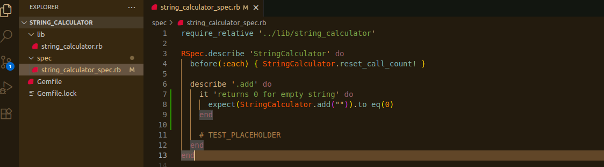
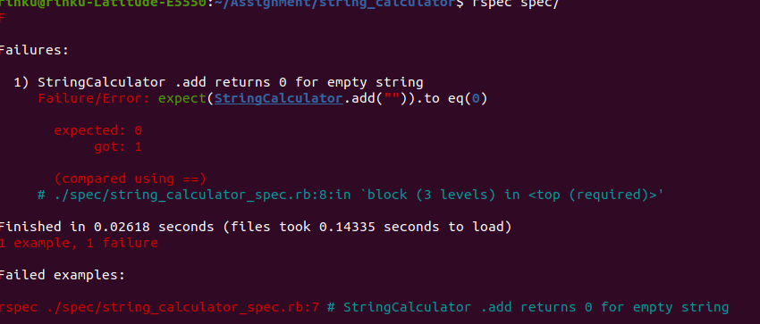
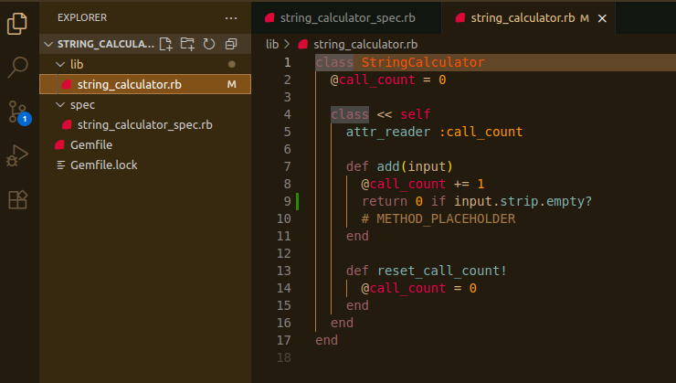
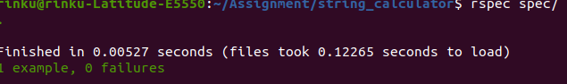
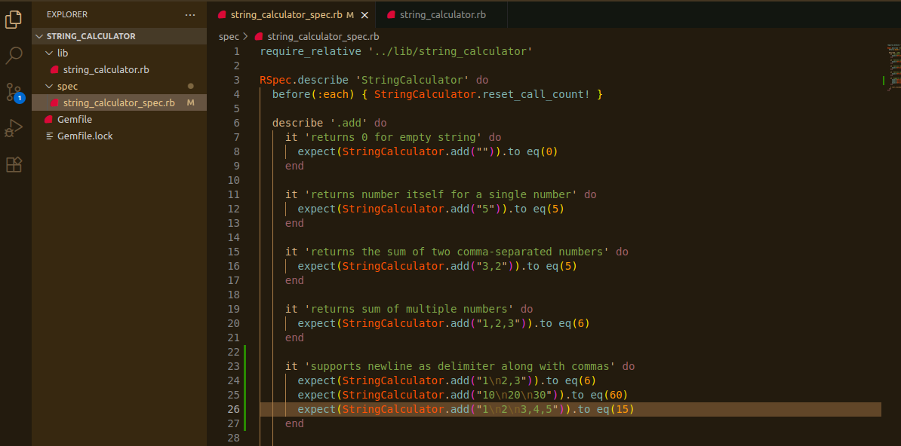
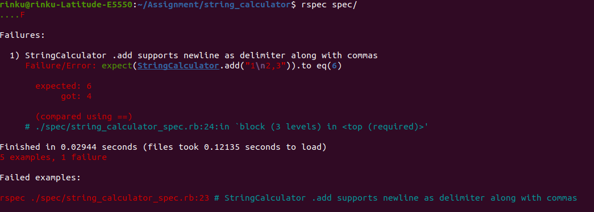
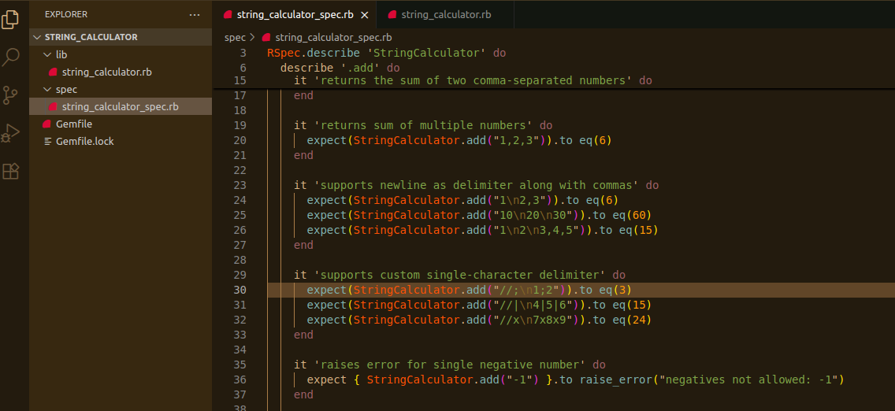
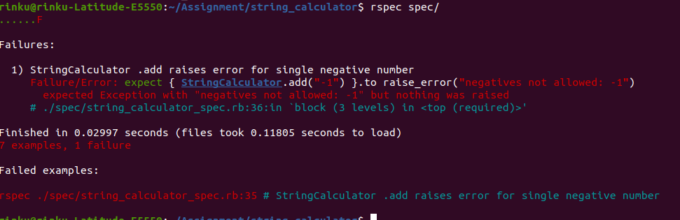
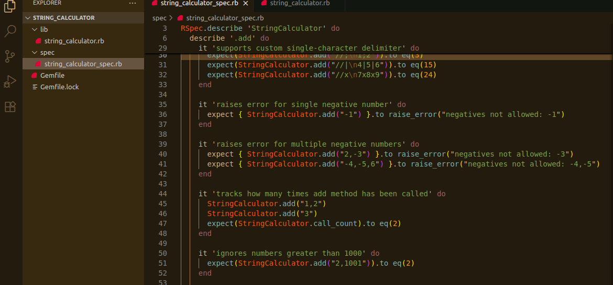
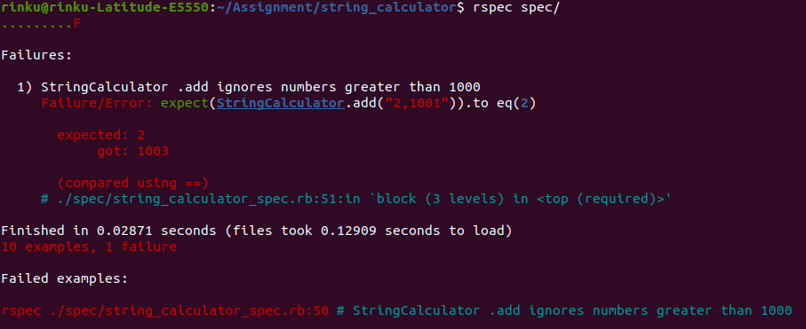
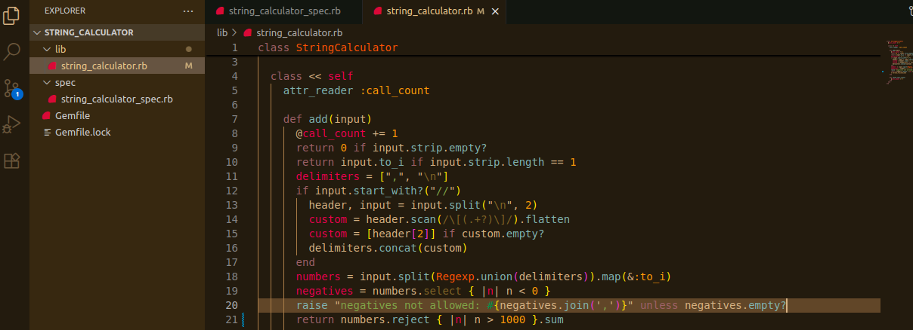
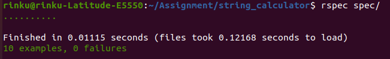
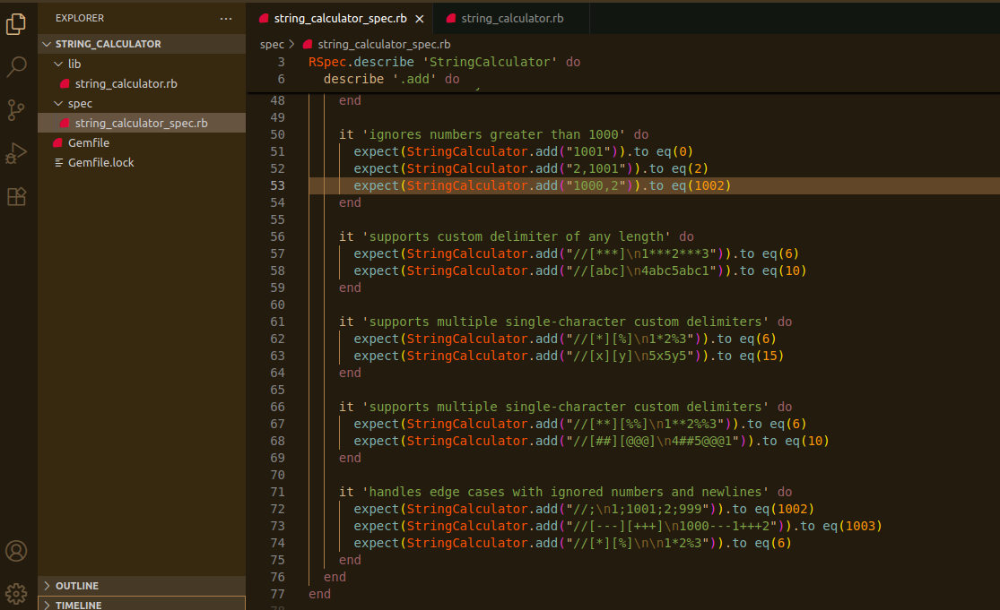
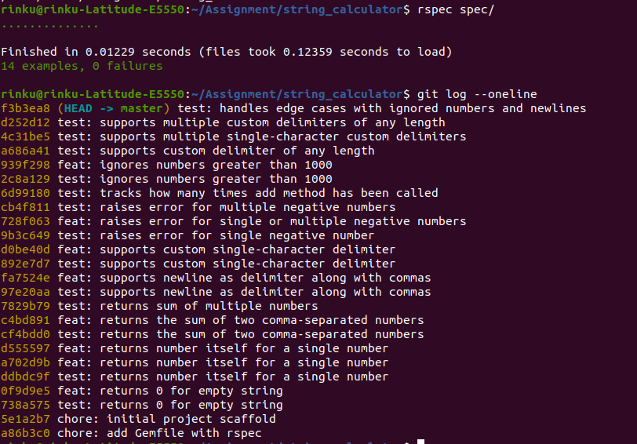

---

## 🗂 File Structure

```
string_calculator/
├── lib/
│   └── string_calculator.rb
├── spec/
│   └── string_calculator_spec.rb
├── Gemfile
└── README.md
```

---

## 🧑‍💻 Tech Stack

- 🧠 Ruby  
- ✅ RSpec (for testing)  
- 🔁 Git (with realistic commit timestamps)  

---

## 🚀 How to Run Tests

```bash
bundle exec rspec
```

📸 Example RSpec run output:


---

## 🔁 Commit Strategy

Each step followed a clean TDD process:

- 🧪 `test: description of test`
- 🔧 `feat: description of implementation`

### Example

```bash
test: returns 0 for empty string  
feat: returns 0 for empty string
```

📸 Git commit log showing evolution:

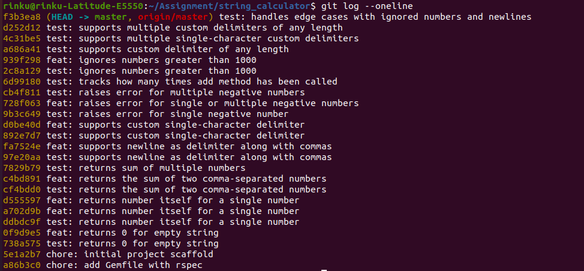

---

📸 GitHub commit timeline:

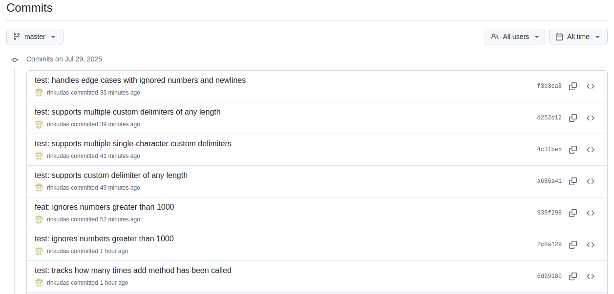

---

## 📬 Author

Built with ❤️ by Rinku Das  
Feel free to connect or fork and enhance!

---